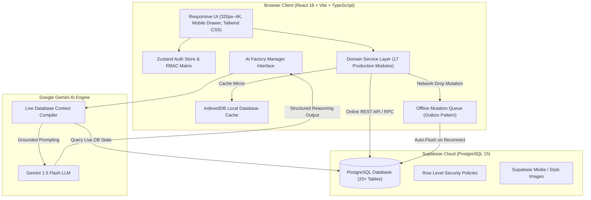
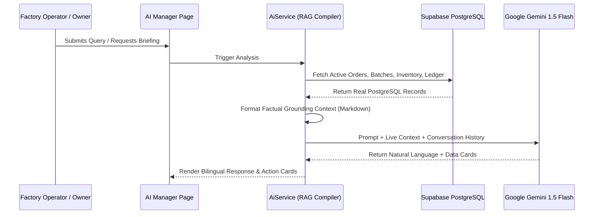

# 🏛️ Factory AI Manager — Technical Architecture & Systems Design

> **Application**: Cloud-Native Enterprise Garment Manufacturing ERP & AI Manager  
> **Client**: React 18, Vite 6, TypeScript, Tailwind CSS, TanStack Query, Zustand  
> **Cloud & Persistence**: Supabase PostgreSQL 15 (Row Level Security), IndexedDB Offline Mirror  
> **AI Subsystem**: Google Gemini 1.5 Flash with Live PostgreSQL RAG Pipeline

---

## 1. High-Level System Architecture



---

## 2. Garment Manufacturing Domain Hierarchy

The data architecture strictly enforces real-world apparel manufacturing relationships:

```
  ┌─────────────────────────────────────────────────────────┐
  │                     PRODUCT MASTER                      │
  │     e.g., "Cotton Kurti Pant Coord Set" (PRD-001)       │
  └────────────────────────────┬────────────────────────────┘
                               │ (Many-to-Many via product_sets)
                               ▼
  ┌─────────────────────────────────────────────────────────┐
  │                      PRODUCT SETS                       │
  │   - Standard Set (SET-STD): Sizes 38, 40, 42, 44, 46    │
  │   - Extra Set (SET-EXT): Sizes 48, 50, 52               │
  │   - Kids Set (SET-KIDS): Sizes 24, 26, 28, 30, 32       │
  │   - Alpha Set (SET-ALPHA): Sizes S, M, L, XL, XXL       │
  └────────────────────────────┬────────────────────────────┘
                               │ (Mapped via set_sizes)
                               ▼
  ┌─────────────────────────────────────────────────────────┐
  │                   SIZES & MEASUREMENTS                  │
  │   - 38 (Chest: 38", Waist: 34", Length: 29", Seq: 1)    │
  │   - 40 (Chest: 40", Waist: 36", Length: 30", Seq: 2)    │
  │   - 42 (Chest: 42", Waist: 38", Length: 30.5", Seq: 3)  │
  │   - 44 (Chest: 44", Waist: 40", Length: 31", Seq: 4)    │
  │   - 46 (Chest: 46", Waist: 42", Length: 31.5", Seq: 5)  │
  └─────────────────────────────────────────────────────────┘
```

---

## 3. AI Intelligence Subsystem (Gemini 1.5 Flash + RAG)

The AI Engine ([`src/services/ai/aiService.ts`](file:///c:/Users/Kavya%20Khandelwal/OneDrive/Desktop/Factory/AI%20Manager/src/services/ai/aiService.ts)) is architected with strict factual grounding:



### Key AI Components:
1. **Live Grounded Assistant**: Answers questions in Hindi and English with live database facts.
2. **AI Daily Executive Briefing**: Synthesizes factory health score, bottlenecks, delayed orders, and cashflow.
3. **Fabric & Sizing Estimator**: Calculates exact meter requirements based on size-wise pieces and 5% cutting wastage buffer.
4. **QC Defect Root-Cause Analyzer**: Identifies stage-wise quality anomalies and outputs corrective action plans.

---

## 4. Responsive UI & Navigation Architecture

- **Mobile Drawer Pattern**: Screen width $< 1024\text{px}$ hides static sidebar and activates a slide-out overlay drawer triggered by TopBar hamburger menu.
- **Zero Page Overflow**: Outer main layout enforces `overflow-x-hidden min-w-0`, delegating horizontal scrolling exclusively to table wrappers (`overflow-x-auto`).
- **Modal Viewport Scaling**: Modals implement `max-h-[92vh]`, `p-2 sm:p-4` gutters, and internal scroll bodies down to 320px screen width.

---

## 5. Offline Resilience & Outbox Pattern

```
Online Mode:
  [UI Action] ➔ [Service Layer] ➔ [Supabase PostgreSQL] ➔ [State Refresh]

Offline Mode:
  [UI Action] ➔ [Service Layer] ➔ [IndexedDB Outbox Queue] ➔ [Optimistic UI]
                                             │
                                   (Network Restored)
                                             ▼
                      [LocalStorageManager.flushOfflineMutations()]
                                             ▼
                                  [Supabase PostgreSQL]
```

---

## 6. Role-Based Access Control (RBAC) Matrix

| Module | `OWNER` | `ADMIN` | `PRODUCTION_MANAGER` | `INVENTORY_MANAGER` | `ACCOUNTANT` | `STAFF` |
| :--- | :---: | :---: | :---: | :---: | :---: | :---: |
| **Dashboard** | Full | Full | View | View | View | View |
| **Orders** | Full | Full | View / Edit | View | View | View |
| **Production** | Full | Full | Full | View | View | Log Output |
| **Inventory** | Full | Full | View | Full | View | View |
| **Purchases** | Full | Full | View | Full | View | — |
| **Dispatch** | Full | Full | Full | Full | View | — |
| **Products** | Full | Full | View | View | View | View |
| **Sets & Sizes** | Full | Full | View | View | View | View |
| **Customers** | Full | Full | View | View | Full | View |
| **Suppliers** | Full | Full | View | Full | Full | View |
| **Payments** | Full | Full | View | View | Full | — |
| **Expenses** | Full | Full | View | View | Full | — |
| **Reports** | Full | Full | Production | Inventory | Financial | — |
| **AI Manager** | Full | Full | Full | Full | Full | Full |
| **Settings** | Full | Full | View | View | View | — |
