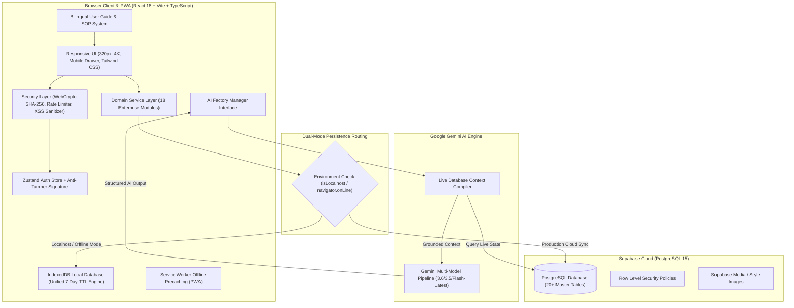
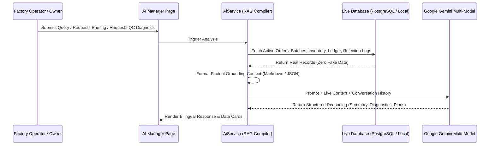

# 🏛️ Factory AI Manager — Technical Architecture & Systems Design

> **Application**: Cloud-Native Enterprise Garment Manufacturing ERP & AI Manager  
> **Client**: React 18, Vite 6, TypeScript, Tailwind CSS, TanStack Query, Zustand, vite-plugin-pwa  
> **Cloud & Persistence**: Supabase PostgreSQL 15 (Row Level Security), IndexedDB Offline Mirror, Localhost 7-Day Isolation Engine  
> **AI Subsystem**: Google Gemini AI Engine (`gemini-3.6-flash`, `gemini-3.5-flash`, `gemini-flash-latest`) with Live PostgreSQL RAG Pipeline  
> **Security**: Web Crypto SHA-256 Hashing, Anti-Tamper HMAC Signatures, Brute-Force Rate Limiting, Strict CSP

---

## 1. High-Level System Architecture



---

## 2. Garment Manufacturing Domain Hierarchy & WIP Piece Flow

### 2.1. Set & Size Multi-Matrix
Apparel styles are categorized into ratio-based sets with exact piece breakdown:

```
  ┌─────────────────────────────────────────────────────────┐
  │                     PRODUCT MASTER                      │
  │     e.g., "Cotton Kurti Pant Coord Set" (PRD-001)       │
  └────────────────────────────┬────────────────────────────┘
                               │ (Many-to-Many via product_sets)
                               ▼
  ┌─────────────────────────────────────────────────────────┐
  │                      PRODUCT SETS                       │
  │   - Standard Set (SET-STD): Sizes 38, 40, 42, 44, 46    │
  │   - Extra Set (SET-EXT): Sizes 48, 50, 52               │
  │   - Kids Set (SET-KIDS): Sizes 24, 26, 28, 30, 32       │
  │   - Alpha Set (SET-ALPHA): Sizes S, M, L, XL, XXL       │
  └────────────────────────────┬────────────────────────────┘
                               │ (Mapped via set_sizes)
                               ▼
  ┌─────────────────────────────────────────────────────────┐
  │                   SIZES & MEASUREMENTS                  │
  │   - 38 (Chest: 38", Waist: 34", Length: 29", Seq: 1)    │
  │   - 40 (Chest: 40", Waist: 36", Length: 30", Seq: 2)    │
  │   - 42 (Chest: 42", Waist: 38", Length: 30.5", Seq: 3)  │
  │   - 44 (Chest: 44", Waist: 40", Length: 31", Seq: 4)    │
  │   - 46 (Chest: 46", Waist: 42", Length: 31.5", Seq: 5)  │
  └─────────────────────────────────────────────────────────┘
```

### 2.2. Sequential Stage-Wise WIP Flow
In real-world manufacturing, batches split dynamically across stages:
1. **Planning (Step 1)**: Batch allocation, fabric requisition, and size breakdown planning.
2. **Cutting (Step 2)**: Fabric roll layering and piece cutting.
3. **Stitching (Step 3)**: Garment assembly and sewing lines. Only cut pieces move here; remaining uncut pieces stay in Cutting.
4. **Finishing (Step 4)**: Washing, thread trimming, and steam pressing.
5. **Quality Check (Step 5)**: Piece-by-piece inspection and defect categorization across 9 defect reasons.
6. **Packing (Step 6)**: Tagging, folding, and carton packaging.
7. **Ready (Step 7)**: Automatically transferred into **Finished Goods Ready Stock** for order fulfillment.

---

## 3. AI Intelligence Subsystem (Gemini LLM + Live RAG)

The AI Engine ([`src/services/ai/aiService.ts`](file:///c:/Users/Kavya%20Khandelwal/OneDrive/Desktop/Factory/AI%20Manager/src/services/ai/aiService.ts)) connects directly to Google Generative Language API with factual database grounding:



### Key AI Components:
1. **Live Grounded Assistant**: Answers questions in Hindi, English, and Hinglish with live database facts.
2. **AI Daily Executive Briefing**: Synthesizes factory health score, bottlenecks, delayed orders, and cashflow directly from real data.
3. **Fabric & Sizing Estimator**: Calculates exact meter requirements based on size-wise pieces, costing, and 5% cutting wastage buffer.
4. **QC Defect Root-Cause Analyzer**: Evaluates actual shop-floor rejection logs and passes defect categories to Gemini for root-cause diagnosis and corrective plans.

---

## 4. Enterprise Security Architecture

```
                                  ┌───────────────────────────────────────────────┐
                                  │           INCOMING REQUEST / ACTION           │
                                  └──────────────────────┬────────────────────────┘
                                                         │
                                    1. Rate Limiting Check (5 attempts / 15-min)
                                                         ▼
                                  ┌───────────────────────────────────────────────┐
                                  │          SALTED SHA-256 AUTHENTICATION        │
                                  │       Web Crypto API SHA-256(password + salt) │
                                  └──────────────────────┬────────────────────────┘
                                                         │
                                    2. Issue HMAC Anti-Tamper Session Signature
                                                         ▼
                                  ┌───────────────────────────────────────────────┐
                                  │           PROTECTED ROUTE VERIFICATION        │
                                  │   verifySecuritySignature(user, signature)    │
                                  │   * DevTools role modification = Auto Logout  │
                                  └──────────────────────┬────────────────────────┘
                                                         │
                                    3. Input Sanitization (XSS Script Prevention)
                                                         ▼
                                  ┌───────────────────────────────────────────────┐
                                  │           IMMUTABLE AUDIT EVENT LOG           │
                                  │          logSecurityEvent('SECURITY_EVENT')   │
                                  └───────────────────────────────────────────────┘
```

- **Salted Web Crypto Hashing**: Passwords are never stored or evaluated in plaintext.
- **Anti-Tamper Signature**: Any manual tampering of `factory_user` in browser localStorage triggers immediate signature validation failure and session revocation.
- **Login Rate Limiter**: 5 consecutive failed attempts trigger a 15-minute lockout cooldown.
- **Content Security Policy**: Strict headers in `index.html` and `vite.config.ts`.

---

## 5. Persistence Architecture & Unified Caching

- **Unified LocalDb**: IndexedDB stores with automatic localStorage sync (`factory_cache_*`) guaranteeing 100% offline recovery.
- **Localhost Isolation**: Testing on `localhost` does not mutate remote cloud tables.
- **7-Day TTL Auto-Purge**: Stale local entries older than 7 days are automatically cleaned by `purgeExpiredLocalData()`.
- **Smart Remote-Local Merge**: Supabase remote queries merge with locally active batches to prevent data loss across deployments.

---

## 6. Role-Based Access Control (RBAC) Matrix

| Module | `OWNER` | `ADMIN` | `PRODUCTION_MANAGER` | `INVENTORY_MANAGER` | `ACCOUNTANT` | `STAFF` |
| :--- | :---: | :---: | :---: | :---: | :---: | :---: |
| **Dashboard** | Full | Full | View | View | View | View |
| **Orders** | Full | Full | View / Edit | View | View | View |
| **Production** | Full | Full | Full | View | View | Log Output |
| **Inventory** | Full | Full | View | Full | View | View |
| **Purchases** | Full | Full | View | Full | View | — |
| **Dispatch** | Full | Full | Full | Full | View | — |
| **Products** | Full | Full | View | View | View | View |
| **Sets & Sizes** | Full | Full | View | View | View | View |
| **Customers** | Full | Full | View | View | Full | View |
| **Suppliers** | Full | Full | View | Full | Full | View |
| **Payments** | Full | Full | View | View | Full | — |
| **Expenses** | Full | Full | View | View | Full | — |
| **Reports** | Full | Full | Production | Inventory | Financial | — |
| **AI Manager** | Full | Full | Full | Full | Full | Full |
| **User Guide & SOP** | Full | Full | Full | Full | Full | Full |
| **Notifications** | Full | Full | Full | Full | Full | Full |
| **Settings** | Full | Full | View | View | View | — |
