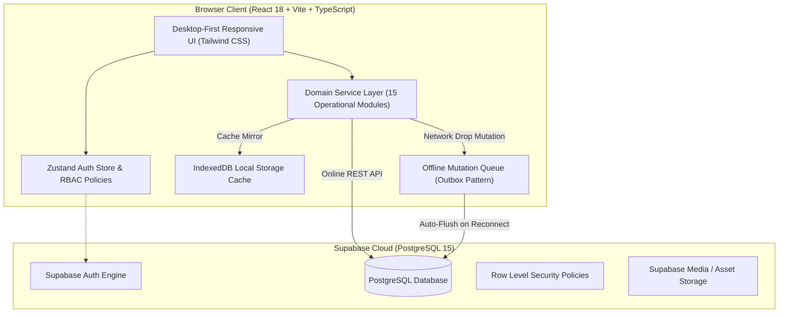

# 🏛️ Factory AI Manager — Architecture & Systems Design

> **Application Type**: Cloud-Native Enterprise Web ERP for Garment Manufacturing  
> **Frontend**: React 18, Vite, TypeScript, Tailwind CSS, TanStack React Query, Zustand  
> **Backend & Storage**: Supabase PostgreSQL 15, IndexedDB Offline Mirror, Local Outbox Queue  
> **Data Strategy**: **100% Real PostgreSQL Data** with zero hardcoded mock fallbacks.

---

## 1. High-Level System Architecture



---

## 2. Garment Business Domain Hierarchy

The system operates around a strict, real-world apparel manufacturing model:

```
  ┌─────────────────────────────────────────────────────────┐
  │                     PRODUCT MASTER                      │
  │   e.g., "Men's Slim Fit Linen Shirt" (SKU: PRD-SHIRT)   │
  └────────────────────────────┬────────────────────────────┘
                               │ (1-to-Many / Linked via product_sets)
                               ▼
  ┌─────────────────────────────────────────────────────────┐
  │                      PRODUCT SETS                       │
  │   - Standard Set (SET-STD): Regular retail sizes        │
  │   - Extra Set (SET-EXT): Plus sizes collection          │
  │   - Kids Set (SET-KIDS): Junior age sizes               │
  └────────────────────────────┬────────────────────────────┘
                               │ (Mapped via set_sizes join table)
                               ▼
  ┌─────────────────────────────────────────────────────────┐
  │                   SIZES & DIMENSIONS                    │
  │   - 38 (Chest: 38", Waist: 34", Length: 29")            │
  │   - 40 (Chest: 40", Waist: 36", Length: 30")            │
  │   - 42 (Chest: 42", Waist: 38", Length: 30.5")          │
  │   - 44 (Chest: 44", Waist: 40", Length: 31")            │
  │   - 46 (Chest: 46", Waist: 42", Length: 31.5")          │
  └─────────────────────────────────────────────────────────┘
```

---

## 3. Real-Time Data Flow & CRUD Engine

### 3.1. 100% Real Live Database Synchronization
- All master records (Customers, Suppliers, Products, Sets, Sizes), transactions (Orders, Production Entries, Dispatches, Purchases, Payments), and operational data are queried directly from Supabase PostgreSQL.
- Mock arrays and fake seed objects have been completely replaced with live queries.

### 3.2. Universal Edit & Delete Operations
- **Customers / Buyer Firms**: Full edit form for GST, contact info, credit terms; Safe delete with foreign constraint checks.
- **Suppliers / Vendor Firms**: Vendor category, materials supplied, contact person, payment terms edit and delete.
- **Products**: Style name, code, fabric, unit price, margin calculation, assigned sets edit and delete.
- **Orders & Purchases**: Full lifecycle updates, cancellation, and deletion with cascading item removal.
- **Inventory & SKUs**: Real-time stock adjustment, SKU details edit, and item deletion.
- **Sets & Sizes**: Interactive set creation with pre-seeded size palette, 1-click presets (`Standard 38-46`, `Plus 48-52`, `Kids 24-32`, `Alpha S-XXL`), inline custom size adder, and full delete operations.
- **Users & RBAC**: Creation and deletion of staff accounts while safeguarding master Factory Owner account.

### 3.3. Offline Resilience (Outbox Queue Pattern)
- When internet connectivity drops on the factory floor:
  1. Mutations are safely written into the local **IndexedDB Outbox Queue**.
  2. Local UI memory updates immediately to prevent shop-floor work disruption.
  3. When `navigator.onLine` fires, the `LocalStorageManager.flushOfflineMutations()` automatically synchronizes queued records to Supabase in FIFO sequence.

### 3.4. Append-Only Auditing
- **`inventory_transactions`**: Every stock adjustment (In, Out, Adjustment, Consumption) creates an immutable record.
- **`audit_logs`**: System actions, configuration changes, and master data updates log the user, timestamp, and payload changes immutably.

---

## 4. Role-Based Access Control (RBAC)

The application enforces permissions across 7 distinct factory roles:

| Role | Scope & Permissions |
| :--- | :--- |
| `OWNER` | Complete system ownership, financial visibility, factory settings, user creation (`kavyakhandelwal57@gmail.com`). |
| `ADMIN` | System administration, user management, audit logs, configuration. |
| `MANAGER` | General plant management across orders, production, inventory, and logistics. |
| `PRODUCTION_MANAGER` | Production planning, batch scheduling, floor progress logging, QC rejection oversight. |
| `INVENTORY_MANAGER` | Stock ledger control, material intake, purchase orders, dispatch tracking. |
| `ACCOUNTANT` | Orders, customer invoicing, supplier payouts, ledger accounting, expense recording. |
| `STAFF` | Floor operation logging, job card entries, stock balance inquiries. |
