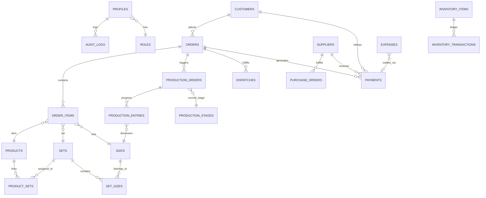

# 🗄️ Factory AI Manager — Database Specification & Schema Architecture

> **Database Engine**: PostgreSQL 15 (hosted on Supabase)  
> **Security Model**: Row Level Security (RLS) with Public/Authenticated Application Access  
> **Integrity**: Append-only auditing on ledger and transaction tables, foreign key relational cascades.

---

## 1. Relational Entity Relationship (ER) Diagram

---

## 2. Table Specifications & Columns

### 2.1. Master Data (Customers, Suppliers, Garments, Sets & Sizes)

#### `customers`
Stores wholesale buyers and retail client profiles.
- `id` (UUID, Primary Key, `uuid_generate_v4()`)
- `customer_code` (VARCHAR(100), UNIQUE, e.g. `CUST-101`)
- `name` (VARCHAR(255), NOT NULL)
- `company_name` (VARCHAR(255))
- `phone` (VARCHAR(50), NOT NULL)
- `email` (VARCHAR(255))
- `gst_number` (VARCHAR(50))
- `pan_number` (VARCHAR(50))
- `billing_address` (TEXT)
- `shipping_address` (TEXT)
- `city` (VARCHAR(100))
- `state` (VARCHAR(100))
- `pincode` (VARCHAR(20))
- `credit_limit` (NUMERIC(12,2), DEFAULT 0.00)
- `outstanding_balance` (NUMERIC(12,2), DEFAULT 0.00)
- `payment_terms` (VARCHAR(100), DEFAULT `'Net 30 Days'`)
- `status` (VARCHAR(20), DEFAULT `'ACTIVE'`)
- `notes` (TEXT)
- `created_at` / `updated_at` (TIMESTAMPTZ)

#### `suppliers`
Stores raw material vendors (fabric mills, trims, thread & packaging manufacturers).
- `id` (UUID, Primary Key)
- `supplier_code` (VARCHAR(100), UNIQUE)
- `name` (VARCHAR(255), NOT NULL)
- `company_name` (VARCHAR(255))
- `phone` (VARCHAR(50), NOT NULL)
- `email` (VARCHAR(255))
- `gst_number` (VARCHAR(50))
- `category` (VARCHAR(100), DEFAULT `'FABRIC'`)
- `address` (TEXT)
- `city` / `state` (VARCHAR(100))
- `bank_name` / `bank_account_number` / `bank_ifsc` (VARCHAR)
- `payment_terms` (VARCHAR(100), DEFAULT `'Net 30 Days'`)
- `lead_time_days` (INT, DEFAULT 7)
- `status` (VARCHAR(20), DEFAULT `'ACTIVE'`)
- `notes` (TEXT)
- `created_at` / `updated_at` (TIMESTAMPTZ)

#### `sets`
First-class garment sizing sets.
- `id` (UUID, Primary Key)
- `name` (VARCHAR(100), UNIQUE, e.g. "Standard Set", "Extra Set", "Kids Set")
- `code` (VARCHAR(50), UNIQUE, e.g. "SET-STD", "SET-EXT")
- `type` (VARCHAR(50), DEFAULT `'ADULT'`)
- `description` (TEXT)
- `status` (VARCHAR(20), DEFAULT `'ACTIVE'`)
- `sort_order` (INT, DEFAULT 0)
- `created_at` / `updated_at` (TIMESTAMPTZ)

#### `sizes`
Individual dimensions belonging to sets.
- `id` (UUID, Primary Key)
- `name` (VARCHAR(50), UNIQUE, e.g. "38", "40", "42", "44", "46", "S", "M", "L")
- `code` (VARCHAR(50))
- `chest_measure` (NUMERIC(6,2))
- `waist_measure` (NUMERIC(6,2))
- `length_measure` (NUMERIC(6,2))
- `status` (VARCHAR(20), DEFAULT `'ACTIVE'`)
- `created_at` / `updated_at` (TIMESTAMPTZ)

#### `set_sizes`
Join table mapping sizes to sets with ordering sequence.
- `id` (UUID, Primary Key)
- `set_id` (UUID, FK ➔ `sets.id`, ON DELETE CASCADE)
- `size_id` (UUID, FK ➔ `sizes.id`, ON DELETE CASCADE)
- `sequence` (INT, DEFAULT 0)
- `ratio` (INT, DEFAULT 1)
- `created_at` (TIMESTAMPTZ)
- *Constraint*: `UNIQUE(set_id, size_id)`

#### `products`
Master apparel garment catalog.
- `id` (UUID, Primary Key)
- `code` (VARCHAR(100), UNIQUE, e.g. `PRD-SHIRT-001`)
- `name` (VARCHAR(255), NOT NULL)
- `category` (VARCHAR(100), e.g. "Shirts", "Trousers", "Coord Sets")
- `subcategory` (VARCHAR(100))
- `fabric` (VARCHAR(255))
- `pattern` (VARCHAR(100))
- `description` (TEXT)
- `unit` (VARCHAR(20), DEFAULT `'pcs'`)
- `cost_price` (NUMERIC(12,2), DEFAULT 0.00)
- `selling_price` (NUMERIC(12,2), DEFAULT 0.00)
- `status` (VARCHAR(20), DEFAULT `'ACTIVE'`)
- `images` (JSONB, DEFAULT `'[]'`)
- `created_at` / `updated_at` (TIMESTAMPTZ)

#### `product_sets`
Join table connecting products to available sets.
- `id` (UUID, Primary Key)
- `product_id` (UUID, FK ➔ `products.id`, ON DELETE CASCADE)
- `set_id` (UUID, FK ➔ `sets.id`, ON DELETE CASCADE)
- `created_at` (TIMESTAMPTZ)
- *Constraint*: `UNIQUE(product_id, set_id)`

---

### 2.2. Orders & Size Matrix Processing

#### `orders`
Master sales orders placed by customers.
- `id` (UUID, Primary Key)
- `order_number` (VARCHAR(100), UNIQUE, e.g. `ORD-2026-0001`)
- `customer_id` (UUID, FK ➔ `customers.id`)
- `order_date` (TIMESTAMPTZ, DEFAULT NOW())
- `delivery_date` (TIMESTAMPTZ, NOT NULL)
- `status` (VARCHAR(50), DEFAULT `'CONFIRMED'`) — `DRAFT`, `CONFIRMED`, `IN_PRODUCTION`, `READY_FOR_DISPATCH`, `COMPLETED`, `CANCELLED`
- `priority` (VARCHAR(20), DEFAULT `'NORMAL'`)
- `payment_status` (VARCHAR(20), DEFAULT `'UNPAID'`)
- `total_quantity` (INT, NOT NULL)
- `subtotal` (NUMERIC(12,2), NOT NULL)
- `tax_rate` (NUMERIC(5,2), DEFAULT 5.00)
- `tax_amount` (NUMERIC(12,2), DEFAULT 0.00)
- `discount_amount` (NUMERIC(12,2), DEFAULT 0.00)
- `grand_total` (NUMERIC(12,2), NOT NULL)
- `paid_amount` (NUMERIC(12,2), DEFAULT 0.00)
- `notes` (TEXT)
- `created_at` / `updated_at` (TIMESTAMPTZ)

#### `order_items`
Individual line items containing size-wise quantities.
- `id` (UUID, Primary Key)
- `order_id` (UUID, FK ➔ `orders.id`, ON DELETE CASCADE)
- `product_id` (UUID, FK ➔ `products.id`)
- `set_id` (UUID, FK ➔ `sets.id`)
- `size_id` (UUID, FK ➔ `sizes.id`)
- `quantity` (INT, NOT NULL)
- `unit_rate` (NUMERIC(12,2), NOT NULL)
- `tax_rate` (NUMERIC(5,2), DEFAULT 5.00)
- `line_total` (NUMERIC(12,2), NOT NULL)
- `produced_quantity` (INT, DEFAULT 0)
- `dispatched_quantity` (INT, DEFAULT 0)
- `created_at` (TIMESTAMPTZ)

---

### 2.3. Production Floor Tracking

#### `production_stages`
Configurable shop floor sequential stages.
- `id` (UUID, Primary Key)
- `name` (VARCHAR(100), UNIQUE) — e.g. `CUTTING`, `STITCHING`, `FINISHING`, `QUALITY CHECK`, `PACKING`, `READY`
- `sequence` (INT, DEFAULT 0)
- `description` (TEXT)
- `color_code` (VARCHAR(50))
- `is_system` (BOOLEAN, DEFAULT false)
- `status` (VARCHAR(20), DEFAULT `'ACTIVE'`)
- `created_at` (TIMESTAMPTZ)

#### `production_orders`
Batch production jobs mapped to customer orders.
- `id` (UUID, Primary Key)
- `production_number` (VARCHAR(100), UNIQUE, e.g. `PROD-2026-0001`)
- `order_id` (UUID, FK ➔ `orders.id`, ON DELETE SET NULL)
- `product_id` (UUID, FK ➔ `products.id`)
- `set_id` (UUID, FK ➔ `sets.id`)
- `current_stage_id` (UUID, FK ➔ `production_stages.id`)
- `total_planned_qty` (INT, NOT NULL)
- `total_completed_qty` (INT, DEFAULT 0)
- `total_rejected_qty` (INT, DEFAULT 0)
- `start_date` (TIMESTAMPTZ, DEFAULT NOW())
- `target_completion_date` (TIMESTAMPTZ, NOT NULL)
- `actual_completion_date` (TIMESTAMPTZ)
- `status` (VARCHAR(50), DEFAULT `'IN_PROGRESS'`)
- `assigned_team` (VARCHAR(100))
- `notes` (TEXT)
- `created_at` / `updated_at` (TIMESTAMPTZ)

#### `production_entries`
Stage progression logs recording piece-by-piece QC metrics.
- `id` (UUID, Primary Key)
- `production_order_id` (UUID, FK ➔ `production_orders.id`, ON DELETE CASCADE)
- `stage_id` (UUID, FK ➔ `production_stages.id`)
- `size_id` (UUID, FK ➔ `sizes.id`)
- `quantity_passed` (INT, NOT NULL)
- `quantity_rejected` (INT, DEFAULT 0)
- `rejection_reason` (TEXT)
- `operator_name` (VARCHAR(100))
- `entry_date` (TIMESTAMPTZ, DEFAULT NOW())
- `notes` (TEXT)

---

### 2.4. Inventory & Immutable Stock Ledger

#### `inventory_items`
Raw materials, trims, packaging, and finished goods inventory.
- `id` (UUID, Primary Key)
- `item_type` (VARCHAR(50)) — `RAW_MATERIAL`, `TRIMS_ACCESSORIES`, `PACKAGING`, `FINISHED_GOODS`
- `sku` (VARCHAR(100), UNIQUE)
- `name` (VARCHAR(255), NOT NULL)
- `category` (VARCHAR(100))
- `unit` (VARCHAR(50), e.g. "meters", "pcs", "rolls", "cartons")
- `current_stock` (NUMERIC(12,2), DEFAULT 0.00)
- `minimum_stock_threshold` (NUMERIC(12,2), DEFAULT 10.00)
- `unit_cost` (NUMERIC(12,2), DEFAULT 0.00)
- `storage_location` (VARCHAR(100))
- `created_at` / `updated_at` (TIMESTAMPTZ)

#### `inventory_transactions` (🔒 Append-Only)
Immutable stock transaction ledger.
- `id` (UUID, Primary Key)
- `item_id` (UUID, FK ➔ `inventory_items.id`)
- `transaction_type` (VARCHAR(50)) — `PURCHASE`, `CONSUMPTION`, `PRODUCTION_OUTPUT`, `DISPATCH`, `ADJUSTMENT`
- `quantity_change` (NUMERIC(12,2), NOT NULL)
- `balance_after` (NUMERIC(12,2), NOT NULL)
- `reference_type` (VARCHAR(50)) — `ORDER`, `PURCHASE_ORDER`, `DISPATCH`, `MANUAL`
- `reference_id` (VARCHAR(100))
- `notes` (TEXT)
- `created_at` (TIMESTAMPTZ, DEFAULT NOW())

---

### 2.5. Purchases, Dispatches, Payments & Expenses

#### `purchase_orders`
Raw material purchases sent to suppliers.
- `id` (UUID, Primary Key)
- `po_number` (VARCHAR(100), UNIQUE)
- `supplier_id` (UUID, FK ➔ `suppliers.id`)
- `status` (VARCHAR(50), DEFAULT `'DRAFT'`) — `DRAFT`, `ORDERED`, `PARTIALLY_RECEIVED`, `RECEIVED`, `CANCELLED`
- `order_date` (TIMESTAMPTZ, DEFAULT NOW())
- `expected_date` (TIMESTAMPTZ)
- `total_amount` (NUMERIC(12,2), DEFAULT 0.00)
- `paid_amount` (NUMERIC(12,2), DEFAULT 0.00)
- `notes` (TEXT)
- `created_at` / `updated_at` (TIMESTAMPTZ)

#### `dispatches`
Order shipments and logistics tracking.
- `id` (UUID, Primary Key)
- `dispatch_number` (VARCHAR(100), UNIQUE)
- `order_id` (UUID, FK ➔ `orders.id`)
- `customer_id` (UUID, FK ➔ `customers.id`)
- `dispatch_date` (TIMESTAMPTZ, DEFAULT NOW())
- `carrier_name` (VARCHAR(150))
- `tracking_number` (VARCHAR(100))
- `vehicle_number` (VARCHAR(50))
- `total_packages` (INT, DEFAULT 1)
- `total_items_count` (INT, NOT NULL)
- `delivery_status` (VARCHAR(50), DEFAULT `'IN_TRANSIT'`)
- `notes` (TEXT)
- `created_at` (TIMESTAMPTZ)

#### `payments`
Inflows from customers and outflows to suppliers.
- `id` (UUID, Primary Key)
- `payment_number` (VARCHAR(100), UNIQUE)
- `payment_type` (VARCHAR(50)) — `CUSTOMER_PAYMENT`, `SUPPLIER_PAYMENT`, `EXPENSE`
- `customer_id` (UUID, FK ➔ `customers.id`, nullable)
- `supplier_id` (UUID, FK ➔ `suppliers.id`, nullable)
- `order_id` (UUID, FK ➔ `orders.id`, nullable)
- `purchase_order_id` (UUID, FK ➔ `purchase_orders.id`, nullable)
- `amount` (NUMERIC(12,2), NOT NULL)
- `payment_date` (TIMESTAMPTZ, DEFAULT NOW())
- `payment_mode` (VARCHAR(50)) — `BANK_TRANSFER`, `CHEQUE`, `CASH`, `UPI`, `CARD`
- `reference_number` (VARCHAR(100))
- `notes` (TEXT)
- `created_at` (TIMESTAMPTZ)

#### `expenses`
Overhead factory expenses and utility costs.
- `id` (UUID, Primary Key)
- `expense_category` (VARCHAR(100), NOT NULL) — e.g. `Electricity & Utilities`, `Machine Maintenance`, `Factory Rent`, `Packaging Supplies`
- `title` (VARCHAR(255), NOT NULL)
- `amount` (NUMERIC(12,2), NOT NULL)
- `expense_date` (DATE, NOT NULL)
- `paid_to` (VARCHAR(255))
- `payment_id` (UUID, FK ➔ `payments.id`, nullable)
- `receipt_image` (TEXT)
- `notes` (TEXT)
- `created_at` (TIMESTAMPTZ)

---

### 2.6. System Security, Notifications & Audit Logs

#### `notifications`
Dynamic system and operational alert logs.
- `id` (UUID, Primary Key)
- `title` (VARCHAR(255), NOT NULL)
- `message` (TEXT, NOT NULL)
- `type` (VARCHAR(50)) — `CRITICAL`, `WARNING`, `INFO`, `SUCCESS`
- `module` (VARCHAR(50)) — `ORDERS`, `PRODUCTION`, `INVENTORY`, `PAYMENTS`
- `link_url` (VARCHAR(255))
- `is_read` (BOOLEAN, DEFAULT false)
- `severity` (VARCHAR(20), DEFAULT `'MEDIUM'`)
- `created_at` (TIMESTAMPTZ)

#### `audit_logs` (🔒 Append-Only)
Immutable operational security trail.
- `id` (UUID, Primary Key)
- `user_id` (UUID, nullable)
- `action` (VARCHAR(100), NOT NULL) — e.g. `CREATE_CUSTOMER`, `UPDATE_ORDER`, `CREATE_PRODUCT`, `DELETE_ITEM`
- `entity` (VARCHAR(100), NOT NULL)
- `entity_id` (VARCHAR(100))
- `new_value` (JSONB)
- `ip_address` (VARCHAR(50))
- `created_at` (TIMESTAMPTZ, DEFAULT NOW())

#### `factory_settings`
Singleton or multi-tenant system & factory configuration record.
- `id` (UUID, Primary Key)
- `factory_name` (VARCHAR(255), NOT NULL)
- `owner_name` (VARCHAR(255))
- `phone` (VARCHAR(50))
- `email` (VARCHAR(255))
- `address` (TEXT)
- `gstin` (VARCHAR(50))
- `currency` (VARCHAR(10), DEFAULT `'₹'`)
- `tax_rate` (NUMERIC(5,2), DEFAULT 5.00)
- `low_stock_threshold` (INT, DEFAULT 10)
- `updated_at` (TIMESTAMPTZ, DEFAULT NOW())

---

## 3. Seed & Reference Data Defaults

### 3.1. Standard Sizing Catalog (22 Sizes)
When the database is freshly initialized, the application auto-seeds standard garment sizes:
- **Numerical Adult Run**: `34`, `36`, `38`, `40`, `42`, `44`, `46`, `48`, `50`, `52`
- **Alphabetical / International Run**: `XS`, `S`, `M`, `L`, `XL`, `2XL`, `3XL`, `4XL`, `5XL`, `Free Size`
- **Kids Run**: `24`, `26`, `28`, `30`, `32`

### 3.2. Initial Admin User
- **Owner Account**: `kavyakhandelwal57@gmail.com`
- **Role**: `FACTORY_OWNER` (Full root administrative access across all tables)
