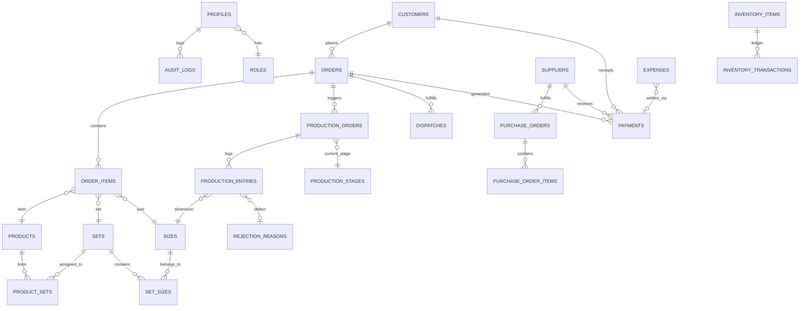

# 🗄️ Factory AI Manager — Database Architecture & Schema Specification

> **Engine**: PostgreSQL 15 (hosted on Supabase Cloud)  
> **Security**: Row Level Security (RLS) enabled on all tables  
> **Integrity**: Foreign keys with cascade rules, unique code constraints, and append-only ledgers.

---

## 1. Entity Relationship (ER) Overview

---

## 2. Master Tables & Column Definitions

### 2.1. Customer & Supplier Masters

#### `customers`
Stores wholesale buyers, distributors, and retail accounts.
- `id` (UUID, Primary Key, `gen_random_uuid()`)
- `customer_code` (VARCHAR(100), UNIQUE)
- `name` (VARCHAR(255), NOT NULL)
- `company_name` (VARCHAR(255))
- `phone` (VARCHAR(50), NOT NULL)
- `email` (VARCHAR(255))
- `gst_number` (VARCHAR(50))
- `billing_address` / `shipping_address` (TEXT)
- `city` / `state` / `pincode` (VARCHAR)
- `credit_limit` (NUMERIC(12,2), DEFAULT 0)
- `outstanding_balance` (NUMERIC(12,2), DEFAULT 0)
- `payment_terms_days` (INT, DEFAULT 30)
- `status` (VARCHAR(20), DEFAULT `'ACTIVE'`)
- `created_at` / `updated_at` (TIMESTAMPTZ)

#### `suppliers`
Stores textile fabric mills, yarn suppliers, trims, and packaging vendors.
- `id` (UUID, Primary Key)
- `supplier_code` (VARCHAR(100), UNIQUE)
- `name` (VARCHAR(255), NOT NULL)
- `company_name` (VARCHAR(255))
- `phone` (VARCHAR(50), NOT NULL)
- `email` (VARCHAR(255))
- `gst_number` (VARCHAR(50))
- `category` / `material_category` (VARCHAR(100), DEFAULT `'FABRIC'`)
- `address` / `city` / `state` (VARCHAR)
- `bank_name` / `bank_account_number` / `bank_ifsc` (VARCHAR)
- `payment_terms_days` (INT, DEFAULT 30)
- `status` (VARCHAR(20), DEFAULT `'ACTIVE'`)
- `created_at` / `updated_at` (TIMESTAMPTZ)

---

### 2.2. Products, Sets & Sizes Hierarchy

#### `products`
Garment styles and tech pack specifications.
- `id` (UUID, Primary Key)
- `code` (VARCHAR(100), UNIQUE, e.g. `PRD-KURTI-01`)
- `name` (VARCHAR(255), NOT NULL)
- `category` (VARCHAR(100), DEFAULT `'Coord Set'`)
- `fabric_composition` (VARCHAR(255))
- `cost_price` (NUMERIC(10,2), DEFAULT 0)
- `selling_price` (NUMERIC(10,2), DEFAULT 0)
- `image_url` (TEXT)
- `status` (VARCHAR(20), DEFAULT `'ACTIVE'`)
- `variants` (JSONB, DEFAULT `'[]'`)
- `created_at` / `updated_at` (TIMESTAMPTZ)

#### `sets`
Garment set definitions.
- `id` (UUID, Primary Key)
- `name` (VARCHAR(100), UNIQUE, e.g. "Standard Set", "Extra Set", "Kids Set")
- `code` (VARCHAR(50), UNIQUE, e.g. "SET-STD", "SET-EXT")
- `type` (VARCHAR(50), DEFAULT `'ADULT'`)
- `status` (VARCHAR(20), DEFAULT `'ACTIVE'`)
- `created_at` / `updated_at` (TIMESTAMPTZ)

#### `sizes`
Individual dimensions.
- `id` (UUID, Primary Key)
- `name` (VARCHAR(50), e.g. "38", "40", "S", "M")
- `code` (VARCHAR(50), UNIQUE)
- `chest_measure` / `waist_measure` / `length_measure` (NUMERIC(6,2))
- `sequence` (INT, DEFAULT 0)
- `status` (VARCHAR(20), DEFAULT `'ACTIVE'`)

#### `set_sizes` (Join Table)
- `id` (UUID, Primary Key)
- `set_id` (UUID, FK ➔ `sets.id` ON DELETE CASCADE)
- `size_id` (UUID, FK ➔ `sizes.id` ON DELETE CASCADE)
- `ratio` (INT, DEFAULT 1)
- `sequence` (INT, DEFAULT 0)

#### `product_sets` (Join Table)
- `id` (UUID, Primary Key)
- `product_id` (UUID, FK ➔ `products.id` ON DELETE CASCADE)
- `set_id` (UUID, FK ➔ `sets.id` ON DELETE CASCADE)

---

### 2.3. Orders, Production & Quality Control

#### `orders`
Wholesale customer orders.
- `id` (UUID, Primary Key)
- `order_number` (VARCHAR(100), UNIQUE, e.g. `ORD-2026-8075`)
- `customer_id` (UUID, FK ➔ `customers.id`)
- `order_date` / `delivery_date` (DATE)
- `priority` (VARCHAR(20), DEFAULT `'NORMAL'`)
- `status` (VARCHAR(30), DEFAULT `'CONFIRMED'`)
- `total_quantity` (INT, DEFAULT 0)
- `subtotal` / `tax_amount` / `grand_total` (NUMERIC(12,2))
- `notes` (TEXT)

#### `order_items`
- `id` (UUID, Primary Key)
- `order_id` (UUID, FK ➔ `orders.id` ON DELETE CASCADE)
- `product_id` (UUID, FK ➔ `products.id`)
- `set_id` (UUID, FK ➔ `sets.id`)
- `size_id` (UUID, FK ➔ `sizes.id`)
- `variant_id` (VARCHAR(100))
- `quantity` (INT, NOT NULL)
- `unit_rate` / `tax_rate` / `total_amount` (NUMERIC(10,2))

#### `production_orders`
Shop-floor batch tracking.
- `id` (UUID, Primary Key)
- `production_number` (VARCHAR(100), UNIQUE, e.g. `PRD-BATCH-101`)
- `order_id` (UUID, FK ➔ `orders.id`)
- `product_id` (UUID, FK ➔ `products.id`)
- `set_id` (UUID, FK ➔ `sets.id`)
- `current_stage_id` (UUID, FK ➔ `production_stages.id`)
- `total_planned_qty` / `total_completed_qty` / `total_rejected_qty` (INT, DEFAULT 0)
- `target_completion_date` (DATE)
- `planned_sizes` (JSONB, DEFAULT `'{}'`)
- `status` (VARCHAR(30), DEFAULT `'IN_PROGRESS'`)

#### `production_entries`
- `id` (UUID, Primary Key)
- `production_order_id` (UUID, FK ➔ `production_orders.id` ON DELETE CASCADE)
- `stage_id` (UUID, FK ➔ `production_stages.id`)
- `size_id` (UUID, FK ➔ `sizes.id`)
- `quantity_passed` / `quantity_rejected` (INT, DEFAULT 0)
- `rejection_reason_id` (UUID, FK ➔ `rejection_reasons.id`)
- `operator_name` / `notes` (TEXT)
- `created_at` (TIMESTAMPTZ)

---

### 2.4. Inventory, Ledger & Financials

#### `inventory_items`
- `id` (UUID, Primary Key)
- `item_code` / `sku` (VARCHAR(100), UNIQUE)
- `name` (VARCHAR(255), NOT NULL)
- `item_type` (VARCHAR(50), e.g. `'RAW_MATERIAL'`, `'WIP'`, `'FINISHED_GOODS'`)
- `category` (VARCHAR(100), e.g. `'FABRIC'`, `'THREAD'`, `'BUTTONS'`, `'PACKAGING'`)
- `unit` (VARCHAR(50), e.g. `'Meters'`, `'Pieces'`, `'Cones'`, `'Gross'`)
- `current_stock` (NUMERIC(12,2), DEFAULT 0)
- `unit_cost` (NUMERIC(10,2), DEFAULT 0)
- `minimum_stock_threshold` (NUMERIC(12,2), DEFAULT 10)
- `location` (VARCHAR(100))

#### `inventory_transactions` (Append-Only Ledger)
- `id` (UUID, Primary Key)
- `item_id` (UUID, FK ➔ `inventory_items.id`)
- `transaction_type` (VARCHAR(20), `'IN'`, `'OUT'`, `'ADJUSTMENT'`)
- `quantity` (NUMERIC(12,2), NOT NULL)
- `reason` / `remarks` (TEXT)
- `reference_id` / `reference_type` (VARCHAR(100))
- `created_at` (TIMESTAMPTZ, DEFAULT now())

#### `purchase_orders` & `purchase_order_items`
- Tracks supplier procurement and inward receiving into `inventory_items`.

#### `dispatches`
- Tracks outbound shipments, transport carriers, LR numbers, and carton packages against customer orders.

#### `payments`
- Financial ledger recording customer receipts (`CUSTOMER_RECEIPT`) and supplier disbursements (`SUPPLIER_PAYMENT`).

#### `expenses`
- Operating overhead vouchers across categories (Electricity, Maintenance, Rent, Spares, Welfare).

#### `app_settings`
- Legal entity name (`Shree Raas Krishnam Creation`), Address, GSTIN, default tax %, currency symbol, and AI Gemini configuration.
